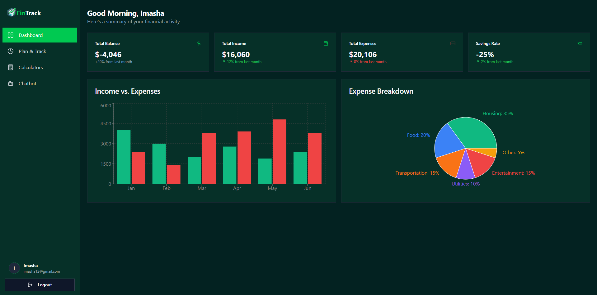

<div align="center">
   <h1 align="center">Fintrack - Finance Planner</h1>
   Fintrack is a modern finance planning application designed to help users manage their finances effectively. With features like expense tracking, budget planning, and financial insights, Fintrack is your go-to tool for financial management. It also includes powerful calculator tools for loans, leasing, mortgages, and taxes, as well as an intelligent finance chatbot to assist with your queries and provide personalized financial advice.
   <br />
  <br />
      
  <br />

  <div>
    
    
    
  </div>
  <br />
  
</div>

## 🚀 Getting Started

### 1. Clone the Repository

First, ensure you have [Git](https://git-scm.com/) installed. Then, clone the repository:

```bash
git clone https://github.com/your-username/fintrack-finance-planner.git
cd fintrack-finance-planner
```

### 2. Install Dependencies

Ensure you have [Node.js](https://nodejs.org/) installed. Then, run:

```bash
npm install
```

### 3. Set Up API Keys

Fintrack uses Firebase and Gemini APIs. Follow these steps to configure them:

#### Firebase

1. Go to [Firebase Console](https://console.firebase.google.com/).
2. Create a new project and generate a Web API key.
3. Add the Firebase configuration to `.env`:
   ```env
   REACT_APP_FIREBASE_API_KEY=your-firebase-api-key
   REACT_APP_FIREBASE_AUTH_DOMAIN=your-firebase-auth-domain
   REACT_APP_FIREBASE_PROJECT_ID=your-firebase-project-id
   ```

#### Gemini

1. Sign up or log in to [Gemini](https://www.gemini.com/).
2. Generate an API key.
3. Add the Gemini configuration to `.env`:
   ```env
   REACT_APP_GEMINI_API_KEY=your-gemini-api-key
   REACT_APP_GEMINI_API_SECRET=your-gemini-api-secret
   ```

### 4. Run the Application

Start the development server:

```bash
npm start
```

Visit `http://localhost:3000` to view the app.

---

## 🛠️ Technologies Used

- **Frontend**: React, TypeScript
- **Backend**: Node.js, Firebase
- **APIs**: Firebase Authentication, Gemini API
- **Deployment**: Vercel

---

## 🌐 Deployment

Fintrack is deployed on [Vercel](https://vercel.com/) and accessible via your custom domain:
[https://your-custom-domain.com](https://your-custom-domain.com)

To deploy updates:

1. Push changes to the `main` branch.
2. Vercel will automatically build and deploy the latest version.

---

## 📚 Documentation

All project documentation is available in the `my-docs` directory, powered by [Docusaurus](https://docusaurus.io/). This includes:

- **Getting Started Guide**
- **Technical Documentation**
- **Incident Response Playbook**
- **Architecture Decision Records**

To view the documentation locally:

1. Navigate to the `my-docs` directory:
   ```bash
   cd my-docs
   ```
2. Install dependencies and start the Docusaurus server:
   ```bash
   npm install
   npm start
   ```
3. Open `http://localhost:3000` in your browser.

---

## 📧 Contact

For support or inquiries, email us at `imasharandima26@gmail.com`.
